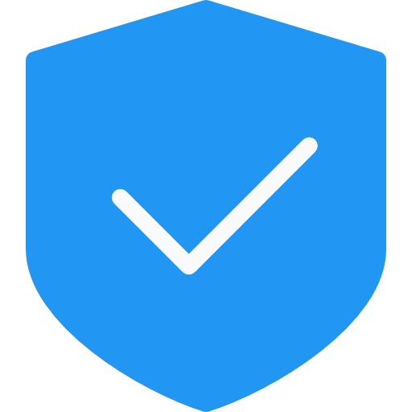
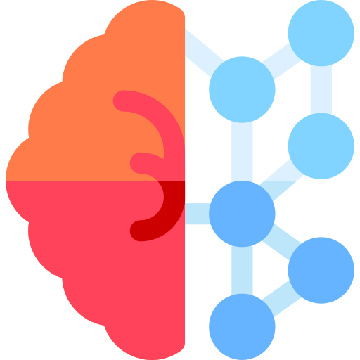

# Guía de estudio para la Certificación

Hola viajeros, aquí tienes una guía (además del simulador) de lo que deberías estudiar (y practicar) para prepararte en tu exámen de certificación.

A continuación encontrarás los temas, tal y como se llaman en el training para que los estudies y algunos ejercicios que puedes realizar para practicar, practicar y finalmente aprobar.

##   Módulo Colaboración

* Crear Equipos Y Editar Sus Características, Agregar Miembros
* Crear Canales Y Editar Sus Características, Agregar Miembros
* Utilizar Grupos De Conversación En Canales Y Chats
* Enviar Y Editar Reuniones

##   Módulo AZURE

* Principios de los grupos de recursos
* Trabajo con Paneles
* Uso del Azure Portal
* Personalización de un panel
* Uso de etiquetas para organizar recursos
* Uso de directivas para aplicar estándares (Azure Policy)

#### Ejercicios de Azure para practicar

* Creación de un sitio web hospedado en Azure 
* Configuración de una instancia de App Service
* Exploración de un Grupo de Recursos y Crear uno  

##    Módulo Seguridad

* Creación de una cuenta de Azure
* Creación y administración de grupos de seguridad de red (Sin la parte de Ubuntu)
* Creación de una línea base de Administración de identidad y acceso (IAM)
    * Creación de una línea base de Azure Security Center
    * Creación de una línea de base de cuentas de almacenamiento de Azure

##    Inteligencia Artificial
* Creación de un experimento en Azure Machine Learning Studio
* Creación de un proyecto de Custom Vision Service
    - Carga de las imágenes etiquetadas
    - Entrenamiento del modelo
    - Prueba del modelo 

##   BOT
* [Compilación de un bot con QnA Maker y Azure Bot Service](https://docs.microsoft.com/es-es/learn/modules/build-faq-chatbot-qna-maker-azure-bot-service/) - *Ejercicio Completo como viene en el training*
* [Compilación de un bot de chat con Azure Bot Service](https://docs.microsoft.com/es-es/learn/modules/build-chat-bot-with-azure-bot-service/)