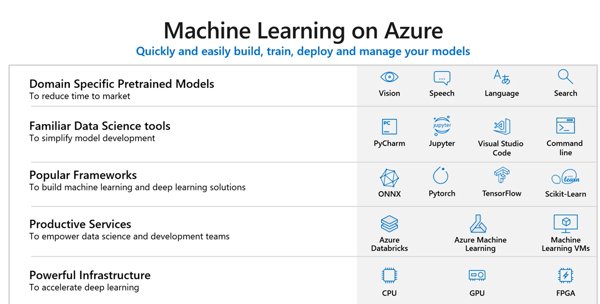

# Sesión de Conceptos de Azure IA

Data + Cloud  + Models

### Modelos 
* Visión
* Speech
* Language

### Azure AI

MS Solutions
* MS Dynamics 365
* 365
* Bing
* XBoxOne

Customer Solutions
* ARCCOS
* Adobe 
* Walmart Labs

### MS Solutions

* Power Point -  Designer
Layout Recomendations

* Speech to Text
Edge - Dictado y lectura en voz alta

* Start with Ideas
Excel - Recomendaciones 

### Security

* Compliance: Certificaciones 
* Privacy: Yo soy dueño de mis datos
* Security: Controles multicapas

## Azure AI

* Knowledge Mining
    - Azure Search

* Machine Learning 
    - Azure Databricks
    - Azure ML 
* AI Apps and Angents - Modelos Pre-entrenados 
    - Azure Cognitive Services
    - Azure Bot Service 

### Mineria del Conocimiento

La capacidad de recuperar y extraer la información dentro de una gran cantidad de datos.

Azure Search: Documentos, Imágenes, Videos.

#### 1 etapa
Mis documentos- Obtener la información valiosa para realizar alguna accion.

#### 2da etapa 
Comienza un proceso de etiquetado:

* Ubicación
* Rostros
* Entidades
* Persona
* Sentimientos
* Celebridad 
* Detección de texto impreso

#### 3era etapa
Realiza una búsqueda enriquecida, a través de Azure Cognitive Search

### Casos de uso

**Servicios Financieros** Dar sentido a un volumen considerable de documentos, formularios y contratos.

**Atención Médica** Demasiados datos clínicos.

### Cognitive Services
Conjunto de Modelos Pre-entrenados de ML

Aprendizaje Automático

Técnica de Ciencia Datos que permite a una computadora aprender a usar datos existentes, sin ser programados para realizar pronosticos, proyecciones. 

Azure ML Servicios basados en Python

Azure DataBricks - Servicios basados en Apache Spark- Big Data

### Cognitive Services

* Vision
* Speech
* Language
* Search

Intelligent Cloud to Inteligent Edge

#### Cómo funciona AZML

* Recolecta y prepara los datos
* Entrenar y evaluar el modelo
* Operar y administrar la información

#### Ventajas

* Permite utilizar un conjunto familiar y poderoso de herramientas de Ciencia de Datos
* Simplifica el uso de Frameworks
* Acelera el tiempo de desarrollo en el ciclo de vida.

### Apps y Agentes

App AI: Es una app web/móvil con capacidades de inteligencia artificial, tales como Vision, Speech o Language.

Agente: Es un programa de máquina que utiliza capacidades de IA  para comunicarse de manera Natural.

CognitiveServices: Modelos preentrenados de IA

### Impacto y la ética en la IA
* Justicia: Todos los sistemas de IA deben tratar a las personas de manera justa. 

* Confiabilidad y Seguridad: Deben funcionar de manera confiable y segura.

* Inclusividad: Deben empoderar a todos y comprometer a las personas.

* Privacidad: Deben ser seguros y respetar tu privacidad

* Transparencia: Deben ser entendibles 

* Rendición de Cuentas: Deben tener una rendición de cuentas algorítmica.

FATE: Equidad, Responsabilidad, Transparencia y Etica.

Tarea: Ver Cambridge Analitica

Nada es secreto

